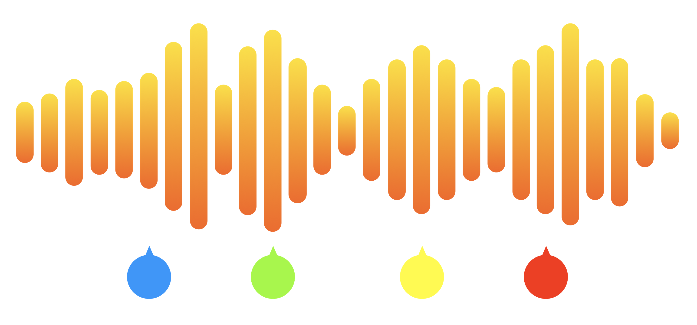

# MusicSegmentationML

## About

MusicSegmentationML is a supervised sequence-to-sequence machine learning project that labels parts of songs (audio WAV files) with their corresponding song segment type (such as verse, chorus, bridge, etc.). You can read more about this project and how to use the code provided [here](tothepowerofn.io/musicsegmentationml/).

This project is written in Python with Keras and provides functions and classes for extracting features (feat_extract.py), generating data to feed into the models (feat_extract.py), and training various models (ml.py).

The primary features extracted from the audio WAV files (at the moment) are MFCC features. Right now, the best model, Faded2DConvModel (see Model_Thoughts.txt for params), achieves ~70% 24-fold validation accuracy (when averaged on the model's maximum accuracies on each fold) on a dataset of 24 different songs.

To provide comments/critiques/suggestions (would be much appreciated!), to request the data used for this project or to make any other inquiries, send an email to me\[at\]nathancontreras\[dot\]com.
